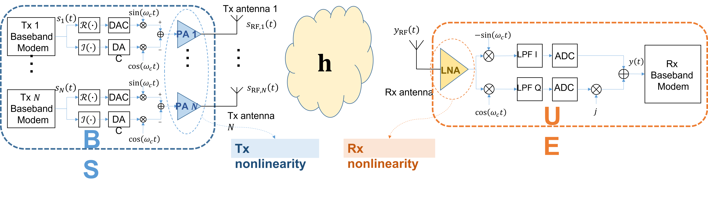
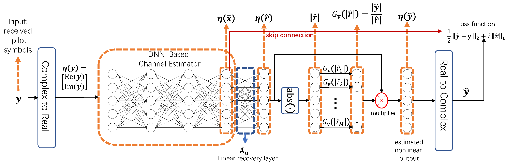

# Channel Estimation with Nonlinearity
 This repository contains the source codes of the paper "Simultaneous learning and inferencing of DNN-based mmWave massive MIMO channel estimation in IoT systems with unknown nonlinear distortion", which is published in IEEE Internet of Things Journal (see https://ieeexplore.ieee.org/abstract/document/9446484).
 
IIn this article, we propose an online training framework for deep neural network (DNN)-based mmWave massive multiple-input multiple-output (MIMO) channel estimation (CE) in Internet-of-Things (IoT) systems with nonlinear amplifier distortions.

For unknown nonlinearity, we propose a two-stage DNN structure with nonlinear modules, for which the DNN-based CE and nonlinear functions can be jointly trained online based on real-time received pilots.

# Introduction of the codes
Run "main.py" to implement the online training for massive MIMO CE with nonlinearity.

# Note
You may cite us by
@ARTICLE{9446484,
  author={Zheng, Xuanyu and Lau, Vincent K. N.},
  journal={IEEE Internet of Things Journal}, 
  title={Simultaneous Learning and Inferencing of DNN-Based mmWave Massive MIMO Channel Estimation in IoT Systems With Unknown Nonlinear Distortion}, 
  year={2022},
  volume={9},
  number={1},
  pages={783-799},
  doi={10.1109/JIOT.2021.3085659}}